# **Challenge_2-Telecom_FM**
# 📊 **Análisis de Evasión de Clientes (Churn) en Telecomunicaciones**

## 🧭 **Introducción**

Este análisis explora una base de datos de una empresa de telecomunicaciones con el objetivo de comprender los factores asociados a la **evasión de clientes (churn)**. Se aplican procesos de limpieza, exploración, análisis estadístico y visualización para detectar patrones que ayuden a generar recomendaciones estratégicas enfocadas en la retención de clientes.


## 🧹 **Limpieza y Normalización de Datos**

### 🔽 **Origen de los datos**
Los datos fueron obtenidos desde una API en formato `.json` y transformados en un DataFrame de Pandas.

```
datos=requests.get("https://raw.githubusercontent.com/ingridcristh/challenge2-data-science-LATAM/refs/heads/main/TelecomX_Data.json")
resultado=json.loads(datos.text)
df=pd.DataFrame(resultado)
```
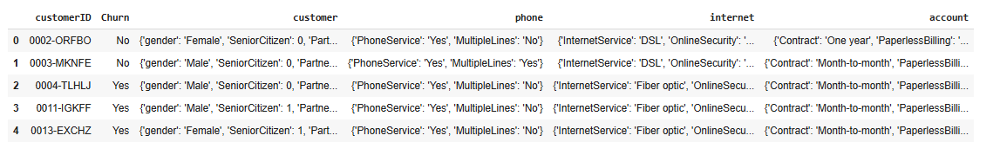


🔧 **Proceso de normalización**
El archivo contenía varias columnas con estructuras anidadas (customer, phone, internet, account), por lo cual se aplicó json_normalize para aplanar los datos y luego se concatenaron.

### 🧼 **Etapas de limpieza**
* Normalización de columnas
```
customer_df = pd.json_normalize(df['customer'])
phone_df = pd.json_normalize(df['phone'])
internet_df = pd.json_normalize(df['internet'])
account_df = pd.json_normalize(df['account'])
```
* Identificación de valores duplicados
```
df_normalizado.duplicated().sum()
```
* Identificación de valores nulos
```
df_normalizado.isnull().sum()
```
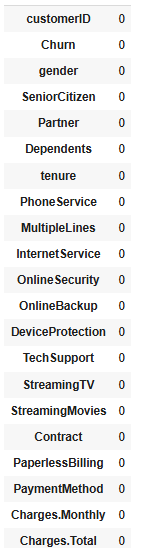


* Valores Unicos de cada variable
```
  columnas=['customerID', 'Churn', 'gender', 'SeniorCitizen', 'Partner',
       'Dependents', 'tenure', 'PhoneService', 'MultipleLines',
       'InternetService', 'OnlineSecurity', 'OnlineBackup', 'DeviceProtection',
       'TechSupport', 'StreamingTV', 'StreamingMovies', 'Contract',
       'PaperlessBilling', 'PaymentMethod', 'Charges.Monthly',
       'Charges.Total']
   for x in columnas:
    print("-------------")
    print(x)
    print(df_normalizado[x].unique())
    
```

👁️‍🗨️ Muestra

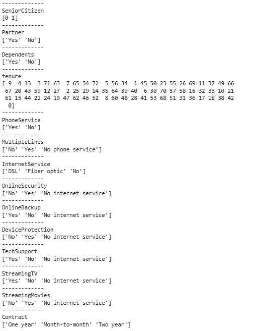

   
* Transformación de datos tipo string a valores numéricos binarios
```
Ejemplo:
df_normalizado["gender"]=df_normalizado["gender"].str.strip().replace({"Female":1,"Male":0})
```
* Conversión de columnas a tipos adecuados (float, int, etc.)
```

df_normalizado["Charges.Total"]=df_normalizado["Charges.Total"].str.strip().replace({"":np.nan})
df_normalizado["Charges.Total"]=df_normalizado["Charges.Total"].astype(float)

```
* Estándar en los textos: minúsculas, sin espacios extra, sin valores vacíos
```
for i in df_normalizado.columns:
    if df_normalizado[i].dtype==object:
        df_normalizado[i]=df_normalizado[i].astype(str).str.lower().replace(r'^\s+|\s+$', '', regex=True)
```
* Creación de nuevas variables como Cuentas_Diarias (gasto mensual dividido por 30)
```
df_normalizado["Cuentas_Diarias"]=df_normalizado["Charges.Monthly"]/30
df_normalizado.sample(10)
```

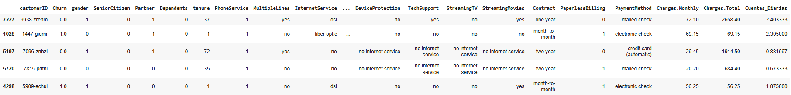


### 📌 **Resultados del Proceso de Transformacion**
Antes:
📷 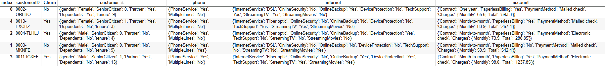

Después: 
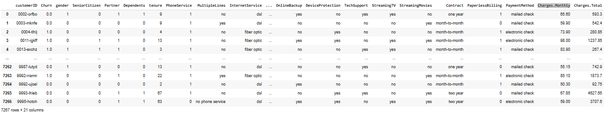

## 🔍 **Análisis Exploratorio (EDA)**
📊 Estadísticas generales

- El 49.42% de los clientes son mujeres.
- El 26.53% del total se ha dado de baja (churn).
- El tiempo promedio de permanencia es de 32.34 meses, con un leve sesgo a la derecha media mayor a mediana, no se aprecian outliers iqr superior =124
- El gasto mensual promedio es de USD $64.72, mientras que el gasto diario es de aproximadamente $2.15.
- 90,27% de la muestra tiene servicio telefonico
- 59,32% de la muestra recibe boleta electronica

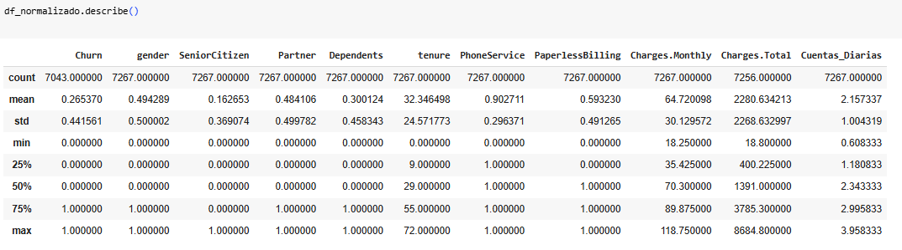


🎯 Coeficiente de variación

:exclamation: Alta dispersión en las variables: SeniorCitizen (226,91%), Churn (166,39%), Dependents (152.72)

❕ Baja dispersión en las variables: Charges.Monthly (46.55%), PhoneService (32.83%), Cuentas_Diarias (46.55%)

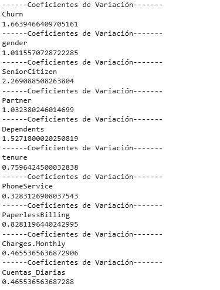

📈 Boxplot: en busqueda de outliers, por reglas de IQR no se aprecian outliers 
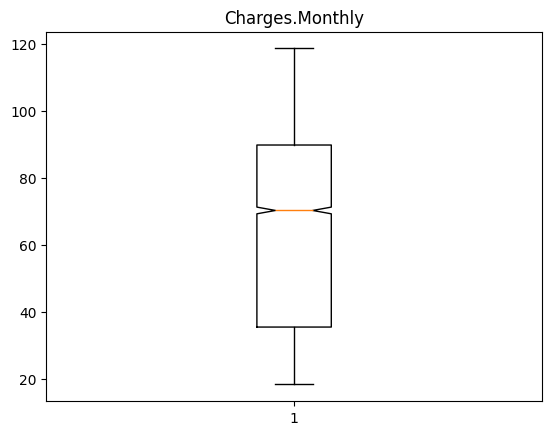
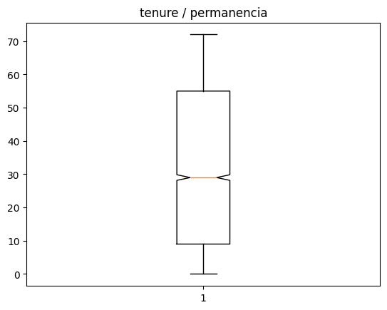


📈 Histograma de Charges.Monthly


🔔 El gasto con mayor frecuencia es el de 20 doláres, luego se aprecia una concentración entre 70 y 100 doláres

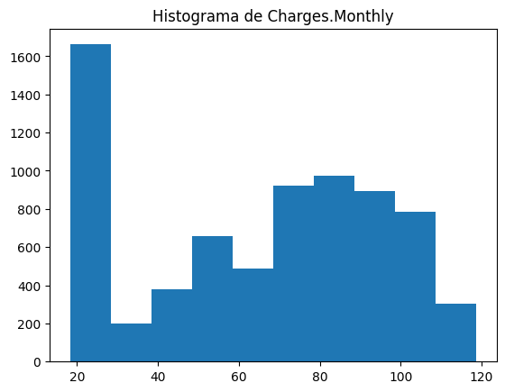

📈 Distribución de clientes según estatus en la compañia (clientes retenidos vs. dados de baja)

❗**la proporci´pn de clientes que abandonan corresponde a un 26,5% del total, equivale a 1.869 clientes**

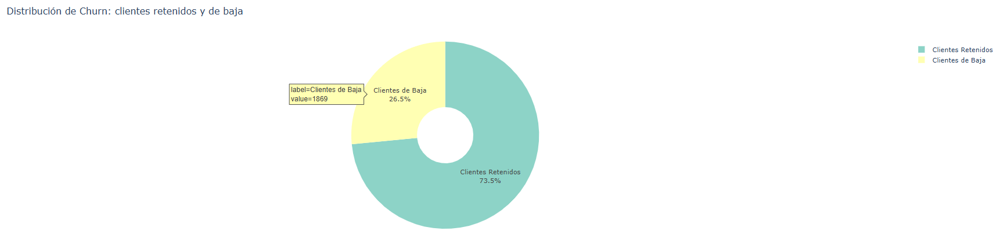

📈 Heatmap de correlación entre variables categóricas

🤯 **Al analizar las caracteristicas de clientes que abandonan podemos observar que en Hombres y Mujeres el contrato month to month y el metodo de pago electronick check concentran la mayor cantidad de clientes que abandonan**

```
fig = px.density_heatmap(
    df_sql_recuento,
    x="Met._Pago",
    y="T_Contrato",
    z="%_Clientes_Abandono",
    facet_col="Género",
    histfunc="avg",
    nbinsx=24, nbinsy=3,
    title="Mapa de Calor: % abandono por contrato y método de pago (por género)",
    color_continuous_scale="Cividis_r",
    text_auto=True
)
fig.update_coloraxes(colorbar_title="% abandono")
fig.show()
```
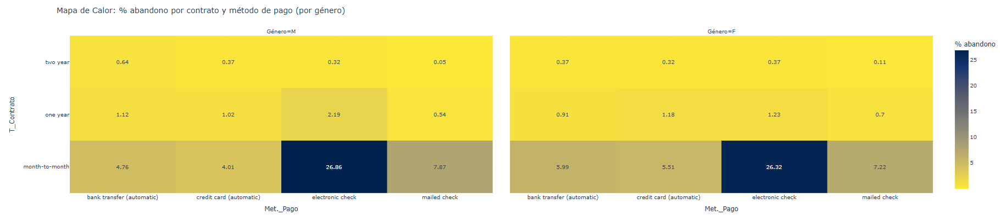

## 📌 Insights Relevantes 
Clientes nuevos tienen más probabilidad de irse: Se observa una correlación negativa entre tenure y Churn (-0.35).
Alrededor del 55% de los clientes que se dan de bajan se encuentran en 2 segmentos:

   :star: El primer segmento: Hombres, con contrato mes a mes y facturacion electronica
   
   :star: El segundo segmento: Mujeres, con contrato mes a mes y facturación electrónica
   
de lo anterior se desprende que el churn no se relaciona fuertemente con el gasto mensual, pero sí con la permanenciay los clientes con menor compromiso (contratos mensuales, sin servicios múltiples) tienden a abandonar más.

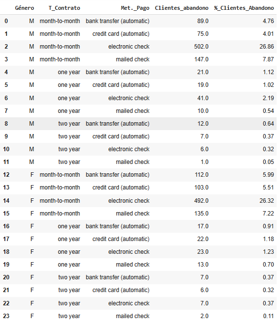

Caracteristicas de los clientes que abandonan (Churn yes=1, Female=1; senior citizen yes=1, partner yes=1, dependents yes=1, phoneService yes=1, paperlessBilling yes=1)
* 50,24% son mujeres
* 25,47% son ciudadanos senior
* 35,79% tienen pareja
* 17,98% tienen dependientes
* 18 meses de permanencia promedio
* gasto promedio mensual de 74 dolares

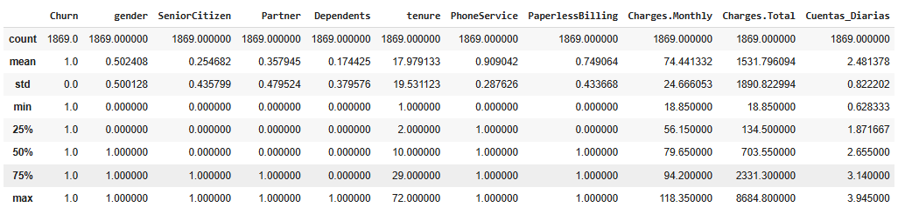


## 📑 Recomendaciones Estratégicas

Basado en los análisis y visualizaciones, se sugiere:

✅ 1. Fortalecer programas de fidelización para nuevos clientes
Intervenir activamente en los primeros 18 meses de permanencia.

Ofrecer bonos o descuentos progresivos para contratos largos.

✅ 2. Incentivar contratos anuales o bianuales
El churn es considerablemente menor entre quienes tienen contratos largos. El promedio de estancia de los clientes que abandonan es de 18 meses.
Ofrecer planes a costo reducidos para periodos puperiores de 18 meses, planes asociados a ventas de equipos con cuota mensual plazo 24 meses

Agregar beneficios exclusivos a clientes con mayor tenure. El costo de traer un nuevo cliente es aprox entre 5 a 7 veces el costo de retener a un cliente

✅ 3. Evaluar medios de pago vinculados con mayor churn
Clientes que pagan con cheques electronicos presentan mayor abandono, ofrecer descuentos por pago con tarjeta de crédito.
Ogfrecer servicios complementarios a bajo costo para aumentar fidelización.

✅ 4. Publicidad
Definir como publico objetivo ciudadnos jovenes (no senior) solteros isn dependientes, ofreciendo planes flexibles

📊 Tablas y gráficos complementarios

**Conculta SQL para obtención de evasión por variables categóricas, usada análisis de variable categórica **
```
query="Select iif(gender=1,'F','M') as 'Género', Contract as 'T_Contrato', PaymentMethod as 'Met._Pago', sum(Churn) as 'Clientes_abandono', round(100*sum(churn)/(select count(*) from df_normalizado where Churn=1),2) as '%_Clientes_Abandono' from df_normalizado where Churn=1 group by gender, Contract,PaymentMethod"
df_sql_recuento=pd.read_sql(query,con=engine)
df_sql_recuento
```
👀
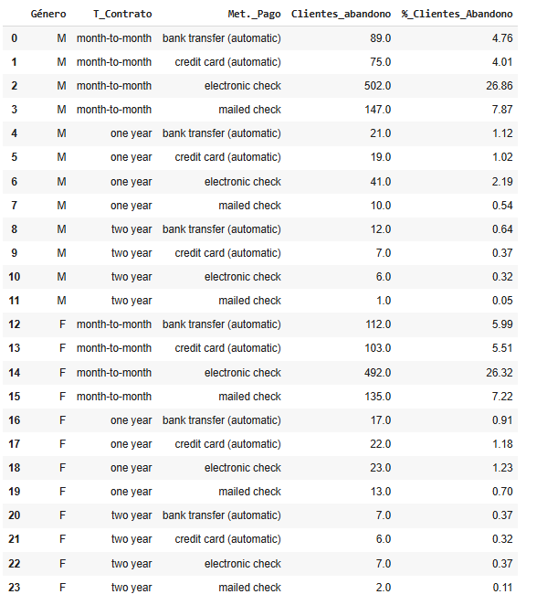


# 📊 **HeatMap Correlación Variables Numéricas**

```
plt.figure(figsize=(8, 6))
sns.heatmap(df_corr, annot=True, fmt=".2f", cmap="coolwarm", square=True, linewidths=0.5)
plt.title("Mapa de correlación entre variables numéricas")
plt.show()
```
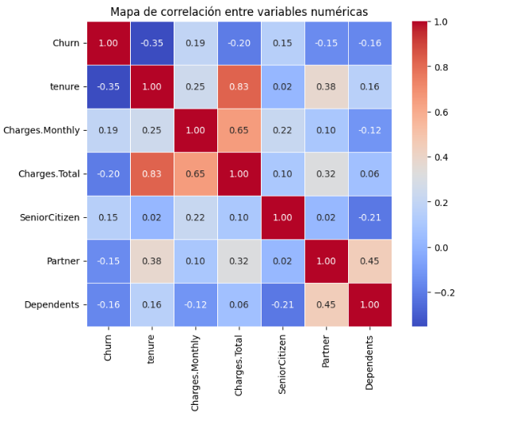


🧾 Conclusión
El análisis de churn revela patrones claves sobre el comportamiento de los clientes que abandonan el servicio. Aunque no hay una única variable predictora fuerte, la combinación de permanencia, tipo de contrato y medio de pago permite identificar segmentos con alto riesgo de evasión. Estos resultados pueden guiar estrategias de retención enfocadas y medibles.

